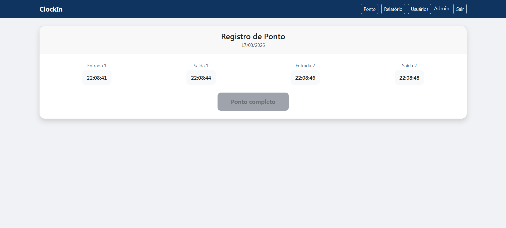
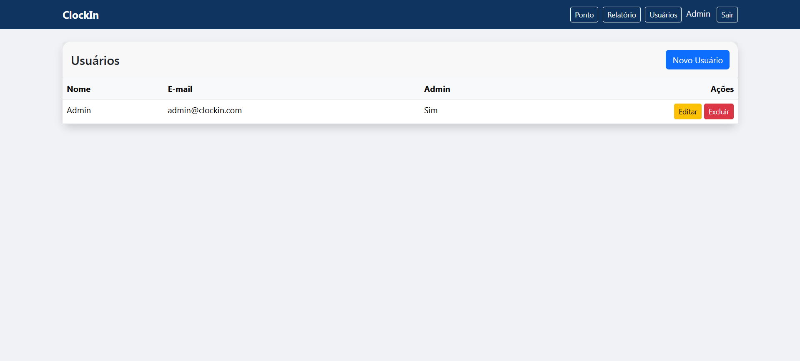
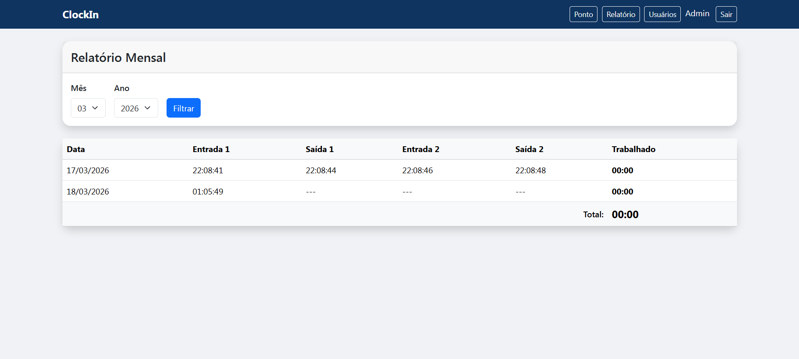

# ClockIn

Sistema de controle de ponto eletrônico desenvolvido em PHP puro, sem framework, seguindo a arquitetura MVC.

## Sobre o projeto
ClockIn é um sistema web completo para registro e controle de ponto de funcionários. Desenvolvido do zero em PHP puro para demonstrar domínio dos fundamentos antes de utilizar frameworks como Laravel.

## Funcionalidades
- Autenticação completa (login, logout, proteção de rotas)
- Registro de ponto com 4 batimentos diários (entrada/saída)
- CRUD de usuários com controle de acesso (admin)
- Relatório mensal com cálculo de horas trabalhadas
- Validação de formulários no backend
- Proteção contra SQL Injection (PDO prepared statements)
- Proteção contra XSS (htmlspecialchars)
- Proteção contra CSRF (token por sessão)
- Senhas com hash (password_hash/password_verify)
- Flash messages para feedback ao usuário
- Layout responsivo com Bootstrap 5.3

## Screenshots

### Tela de Login


### Registro de Ponto


### Gerenciamento de Usuários


### Relatório Mensal


## Tecnologias
- PHP 8.5
- MySQL 8.4
- PDO (prepared statements)
- Docker + Docker Compose
- Bootstrap 5.3
- Git

## Arquitetura
```
clockin/
├── public/            # Único diretório acessível pela web
│   ├── index.php      # Front Controller
│   └── .htaccess      # Reescrita de URL
├── src/
│   ├── Core/          # Infraestrutura (Router, Database, Session, CSRF, Validator)
│   ├── Controllers/   # Recebem requisições e orquestram a lógica
│   └── Models/        # Comunicação com o banco de dados
├── views/
│   ├── layouts/       # Layout base compartilhado
│   ├── auth/          # Telas de autenticação
│   ├── clock/         # Tela de registro de ponto
│   ├── users/         # Telas de CRUD de usuários
│   └── reports/       # Telas de relatórios
├── database/          # Script SQL de criação das tabelas
├── Dockerfile         # Receita do container PHP + Apache
├── docker-compose.yml # Orquestração dos containers
└── composer.json      # Autoload PSR-4
```

## Como rodar o projeto
1. Clone o repositório:
```bash
git clone git@github.com:israelcarvalhotech/clockin.git
cd clockin
```
2. Suba os containers:
```bash
docker compose up -d --build
```
3. Instale as dependências:
```bash
docker compose run --rm app composer install
```
4. Crie as tabelas no banco:
```bash
docker exec -i clockin-db-1 mysql -u root -proot_pass clockin < database/schema.sql
```
5. Acesse no navegador:
```
http://localhost:8080
```
6. Login padrão:
```
Email: admin@clockin.com
Senha: password
```

## Seguranca
- SQL Injection: prevenido com PDO prepared statements
- XSS: prevenido com htmlspecialchars() em todas as saidas
- CSRF: token unico por sessao em todos os formularios POST
- Senhas: armazenadas com hash bcrypt via password_hash()
- Rotas protegidas: verificacao de sessao em cada controller
- Controle de acesso: funcoes administrativas restritas a usuarios admin

## Autor
Israel Carvalho - [GitHub](https://github.com/israelcarvalhotech)